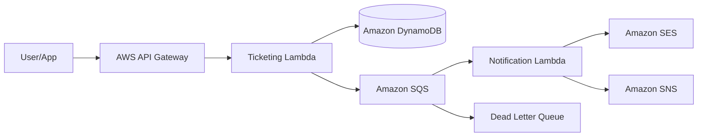

# serverless-ticketing-notifications

Backend serverless para emissão de ingressos, reservas temporárias e notificações multicanais, desenvolvido como projeto prático da residência tecnológica.

O projeto tem como objetivo aplicar conceitos de **Python**, **AWS**, **arquitetura serverless**, **Clean Architecture**, **SOLID**, **modelagem de domínio**, **testes automatizados** e **separação de responsabilidades** em um cenário próximo de um sistema real de alta concorrência.

## Sumário

- [Visão Geral](#visão-geral)
- [Domínios do Sistema](#domínios-do-sistema)
  - [Ticketing](#ticketing)
  - [Notifications](#notifications)
- [Arquitetura Planejada](#arquitetura-planejada)
  - [Fluxo de Compra e Notificação](#fluxo-de-compra-e-notificação)
- [Endpoints Planejados](#endpoints-planejados)
- [Modelagem de Dados](#modelagem-de-dados)
  - [Tabela `Ticket`](#tabela-ticket)
  - [Tabela `Notification`](#tabela-notification)
- [Regra de Cálculo de Preço](#regra-de-cálculo-de-preço)
- [Estrutura de Pastas](#estrutura-de-pastas)
  - [Responsabilidade das Camadas](#responsabilidade-das-camadas)
- [Princípios Arquiteturais](#princípios-arquiteturais)
- [Conceitos Praticados](#conceitos-praticados)
  - [Clean Architecture](#clean-architecture)
  - [SOLID](#solid)
  - [Strategy Pattern](#strategy-pattern)
  - [Adapter Pattern](#adapter-pattern)
  - [Resiliência Serverless](#resiliência-serverless)
  - [Result Pattern](#result-pattern)
- [Tecnologias Planejadas](#tecnologias-planejadas)
- [Testes](#testes)
  - [Testes unitários](#testes-unitários)
  - [Testes de integração](#testes-de-integração)
- [Como Executar Localmente](#como-executar-localmente)
  - [Pré-requisitos](#pré-requisitos)
  - [Instalação](#instalação)
  - [Execução dos testes](#execução-dos-testes)
  - [Execução local com SAM](#execução-local-com-sam)
- [Roadmap de Implementação](#roadmap-de-implementação)
- [Critérios de Qualidade](#critérios-de-qualidade)
- [Objetivo de Aprendizagem](#objetivo-de-aprendizagem)
- [Status](#status)

---

## Visão Geral

Este sistema simula uma plataforma de venda de ingressos para eventos, com suporte a:

* listagem de eventos disponíveis;
* consulta de categorias de ingressos;
* reserva temporária de ingressos;
* checkout de reservas;
* publicação assíncrona de notificações;
* envio de notificações por e-mail, SMS ou push;
* proteção contra overbooking usando escrita condicional no DynamoDB;
* desacoplamento entre o domínio de vendas e o domínio de comunicação.

A arquitetura foi pensada para separar claramente a regra de negócio dos detalhes de infraestrutura, permitindo que os casos de uso sejam testados sem dependência direta de AWS, banco de dados, filas ou serviços externos.

---

## Domínios do Sistema

### Ticketing

Responsável pelas regras relacionadas à venda e reserva de ingressos.

Principais responsabilidades:

* consultar eventos;
* consultar categorias de ingressos;
* controlar disponibilidade de ingressos;
* reservar ingressos temporariamente;
* efetivar checkout;
* impedir venda acima do estoque disponível;
* publicar uma intenção de notificação após uma compra aprovada.

### Notifications

Responsável pelo processamento e envio de comunicações.

Principais responsabilidades:

* consumir mensagens assíncronas da fila;
* identificar o canal de envio adequado;
* enviar notificações por e-mail, SMS ou push;
* registrar status da notificação;
* lidar com falhas de processamento de forma resiliente.

---

## Arquitetura Planejada



### Fluxo de Compra e Notificação

1. O usuário faz uma requisição HTTP via API Gateway.
2. O API Gateway aciona a Lambda de Ticketing.
3. A Lambda executa o caso de uso correspondente.
4. O domínio de Ticketing consulta ou atualiza dados no DynamoDB por meio de adapters.
5. A reserva ou compra utiliza escrita condicional para evitar overbooking.
6. Após o checkout, uma mensagem de notificação é publicada na SQS.
7. A Lambda de Notifications consome a mensagem de forma assíncrona.
8. O sistema escolhe a estratégia de envio adequada.
9. A notificação é enviada via SES, SNS ou outro provedor.
10. Em caso de falhas recorrentes, a mensagem pode ser direcionada para uma DLQ.

---

## Endpoints Planejados

| Método | Endpoint                                  | Descrição                                                           |
| ------ | ----------------------------------------- | ------------------------------------------------------------------- |
| `GET`  | `/events`                                 | Lista os eventos disponíveis e a quantidade de ingressos restantes. |
| `GET`  | `/events/{event_id}/tickets`              | Lista as categorias de ingressos e preços de um evento.             |
| `POST` | `/events/{event_id}/reservations`         | Tenta realizar a reserva temporária de ingressos.                   |
| `POST` | `/reservations/{reservation_id}/checkout` | Efetiva a compra de uma reserva aprovada e dispara a notificação.   |

### Exemplo de body para reserva

```json
{
  "user_id": "123",
  "ticket_category": "camarote",
  "quantity": 1
}
```

---

## Modelagem de Dados

A modelagem inicial utiliza tabelas separadas por domínio para reforçar o isolamento entre contextos.

### Tabela `Ticket`

Tabela responsável pelos dados do domínio de vendas.

| Campo                | Descrição                                                          |
| -------------------- | ------------------------------------------------------------------ |
| `PK`                 | Chave de partição. Exemplo: `EVENT#991`.                           |
| `SK`                 | Chave de ordenação. Exemplo: `METADATA` ou `TICKET_TIER#CAMAROTE`. |
| `available_quantity` | Quantidade disponível da categoria de ingresso.                    |
| `base_price`         | Preço base do ingresso.                                            |
| `ticket_category`    | Categoria do ingresso.                                             |
| `event_name`         | Nome do evento.                                                    |

Exemplos de registros:

```text
PK: EVENT#991
SK: METADATA
event_name: Tech Conference 2026
```

```text
PK: EVENT#991
SK: TICKET_TIER#CAMAROTE
available_quantity: 50
base_price: 250.00
ticket_category: camarote
```

### Tabela `Notification`

Tabela responsável pelos registros do domínio de comunicação.

| Campo          | Descrição                                      |
| -------------- | ---------------------------------------------- |
| `PK`           | Chave de partição. Exemplo: `USER#123`.        |
| `SK`           | Chave de ordenação. Exemplo: `NOTIF#abc-123`.  |
| `type`         | Tipo da notificação: `EMAIL`, `SMS` ou `PUSH`. |
| `status`       | Status da notificação: `SENT` ou `FAILED`.     |
| `message_body` | Conteúdo da mensagem em formato JSON.          |

---

## Regra de Cálculo de Preço

O valor total da compra pode considerar o preço base, a quantidade de ingressos e uma taxa de conveniência.

```text
total_price = (base_price * ticket_quantity) + (base_price * convenience_fee_percentage / 100)
```

Onde:

* `base_price` representa o preço base da categoria do ingresso;
* `ticket_quantity` representa a quantidade de ingressos solicitada;
* `convenience_fee_percentage` representa o percentual da taxa de conveniência.

---

## Estrutura de Pastas

```text
serverless-ticketing-notifications/
├── template.yaml
├── pyproject.toml
├── README.md
├── src/
│   ├── ticketing/
│   │   ├── abstraction/
│   │   ├── domain/
│   │   ├── usecase/
│   │   └── infrastructure/
│   └── notifications/
│       ├── abstraction/
│       ├── domain/
│       ├── usecase/
│       └── infrastructure/
└── tests/
    ├── unit/
    └── integration/
```

### Responsabilidade das Camadas

#### `domain`

Contém as entidades, value objects, regras essenciais e erros de negócio.

Essa camada não deve importar bibliotecas web, AWS SDK, boto3, frameworks HTTP ou detalhes de banco de dados.

#### `usecase`

Contém os casos de uso da aplicação.

É responsável por orquestrar regras de negócio, validar fluxos e coordenar contratos abstratos, como repositórios e publishers.

#### `abstraction`

Contém contratos, interfaces ou protocols usados pelos casos de uso.

Exemplos:

* `TicketRepository`
* `ReservationRepository`
* `NotificationPublisher`
* `NotificationStrategy`

#### `infrastructure`

Contém implementações concretas ligadas a ferramentas externas.

Exemplos:

* adapter de DynamoDB;
* publisher de SQS;
* adapter de SES;
* adapter de SNS;
* handlers Lambda;
* mapeadores de entrada e saída HTTP.

---

## Princípios Arquiteturais

Este projeto segue a ideia de que frameworks, banco de dados, filas e serviços cloud são detalhes externos.

A regra de negócio deve permanecer independente de infraestrutura.

### Regras importantes

* Casos de uso não devem importar `boto3`.
* Entidades de domínio não devem conhecer API Gateway, Lambda, DynamoDB ou SQS.
* Adapters devem implementar contratos definidos nas camadas internas.
* Erros ou resultados de negócio devem ser traduzidos para HTTP apenas na camada externa.
* Testes unitários devem conseguir validar domínio e casos de uso sem AWS.

---

## Conceitos Praticados

### Clean Architecture

Separação entre regras de negócio, casos de uso, contratos e infraestrutura.

### SOLID

Aplicação principalmente do princípio de inversão de dependência.

Os casos de uso dependem de abstrações, não de implementações concretas.

### Strategy Pattern

Utilizado no domínio de notificações para selecionar a estratégia de envio adequada.

Exemplos:

* `EmailNotificationStrategy`
* `SmsNotificationStrategy`
* `PushNotificationStrategy`

### Adapter Pattern

Utilizado para encapsular detalhes de integração com serviços externos.

Exemplos:

* `SesEmailAdapter`
* `SnsSmsAdapter`
* `DynamoDbTicketRepository`
* `SqsNotificationPublisher`

### Resiliência Serverless

Uso de SQS como buffer assíncrono e DLQ para mensagens que não puderem ser processadas após múltiplas tentativas.

### Result Pattern

Uso de objetos de resultado para representar sucesso ou falha de negócio sem acoplar diretamente o domínio a códigos HTTP.

Exemplo:

```text
OutOfStock -> HTTP 409 Conflict
InvalidReservation -> HTTP 400 Bad Request
ReservationNotFound -> HTTP 404 Not Found
```

A tradução para HTTP deve acontecer apenas na camada de entrada da aplicação.

---

## Tecnologias Planejadas

* Python
* AWS Lambda
* Amazon API Gateway
* Amazon DynamoDB
* Amazon SQS
* Amazon SES
* Amazon SNS
* AWS SAM
* CloudFormation
* boto3
* pytest
* moto
* uv

---

## Testes

A estratégia de testes será dividida em dois grupos principais.

### Testes unitários

Validam regras puras de domínio e casos de uso.

Exemplos:

* deve listar eventos disponíveis;
* deve impedir reserva sem estoque suficiente;
* deve calcular preço total corretamente;
* deve criar uma reserva válida;
* deve efetivar checkout de uma reserva aprovada;
* deve publicar mensagem de notificação após checkout;
* deve selecionar a estratégia correta de notificação.

### Testes de integração

Validam adapters e integrações com serviços simulados.

Exemplos:

* adapter de DynamoDB salvando e consultando registros;
* publisher de SQS enviando mensagem;
* consumer processando mensagem de notificação;
* comportamento de falhas com DLQ.

---

## Como Executar Localmente

> Esta seção será evoluída conforme a implementação avançar.

### Pré-requisitos

* Python instalado;
* uv instalado;
* AWS CLI configurado;
* AWS SAM CLI instalado;
* conta AWS ou ambiente local de simulação;
* pytest para execução dos testes.

### Instalação

```bash
uv sync
```

### Execução dos testes

```bash
uv run pytest
```

### Execução local com SAM

```bash
sam build
sam local start-api
```

---

## Roadmap de Implementação

### Fase 1 — Base do Projeto

* [x] Criar estrutura inicial de pastas.
* [x] Configurar `pyproject.toml`.
* [x] Configurar ambiente com `uv`.
* [x] Configurar `pytest`.
* [x] Criar primeiro teste unitário.
* [x] Garantir que domínio e casos de uso não dependem de AWS.

### Fase 2 — Domínio de Ticketing

* [x] Criar entidades de evento, categoria de ingresso e reserva.
* [ ] Criar regras de estoque.
* [ ] Criar cálculo de preço.
* [ ] Criar casos de uso de listagem, reserva e checkout.
* [ ] Criar testes unitários para regras principais.

### Fase 3 — Domínio de Notifications

* [ ] Criar entidade de notificação.
* [ ] Criar contrato de estratégia de envio.
* [ ] Criar estratégias de e-mail, SMS e push.
* [ ] Criar caso de uso de envio de notificação.
* [ ] Criar testes unitários para roteamento de estratégia.

### Fase 4 — Infraestrutura AWS

* [ ] Implementar repositório com DynamoDB.
* [ ] Implementar publisher com SQS.
* [ ] Implementar adapters com SES e SNS.
* [ ] Implementar handlers Lambda.
* [ ] Criar template AWS SAM.
* [ ] Configurar permissões IAM.

### Fase 5 — Resiliência e Observabilidade

* [ ] Configurar DLQ.
* [ ] Adicionar logs estruturados.
* [ ] Adicionar tratamento consistente de erros.
* [ ] Adicionar métricas ou rastreamento básico.
* [ ] Validar comportamento em falhas simuladas.

---

## Critérios de Qualidade

Este projeto deve buscar:

* código simples e legível;
* nomes claros;
* funções pequenas;
* responsabilidades bem definidas;
* baixo acoplamento entre camadas;
* testes automatizados;
* domínio protegido de detalhes externos;
* evolução incremental;
* decisões arquiteturais justificadas.

---

## Objetivo de Aprendizagem

O objetivo principal não é apenas construir uma API funcional, mas desenvolver maturidade técnica para:

* modelar domínio de forma clara;
* separar regra de negócio de infraestrutura;
* lidar com concorrência e estoque;
* usar filas para processamento assíncrono;
* aplicar padrões de projeto com propósito;
* testar regras de negócio com segurança;
* projetar uma solução serverless evolutiva;
* compreender trade-offs de arquitetura em ambiente cloud.

---

## Status

Projeto em fase inicial de implementação.

Este repositório será evoluído incrementalmente durante o tempo.
