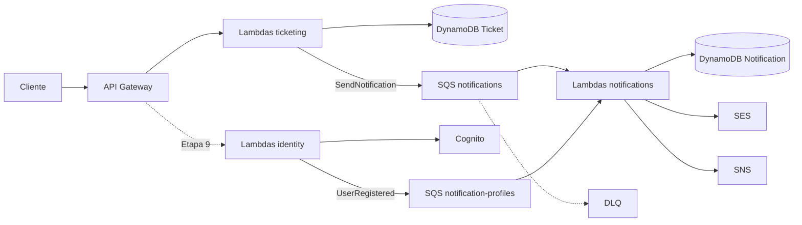

# ticketstream

Backend serverless para venda de ingressos com alta concorrência e notificações multicanais, desenvolvido como projeto
prático da residência tecnológica.

O objetivo é aplicar **Python**, **AWS serverless**, **Clean Architecture**, **SOLID**, **modelagem de domínio** e
**testes automatizados** num cenário próximo de um sistema real: reserva temporária de ingressos, proteção contra
overbooking e comunicação assíncrona entre contextos.

---

## Visão geral

Bounded contexts independentes, que se ligam só por mensagens SQS e pelo token, nunca por código:

- **`ticketing`**: eventos, categorias de ingresso, reserva temporária (lock) e checkout com pagamento simulado.
- **`notifications`**: motor genérico que recebe um comando de envio e o roteia pelo canal preferido do usuário:
  e-mail (SES) ou SMS (SNS). Push está previsto como extensão. Não tem endpoint público.
- **`identity`** *(Etapa 9)*: cadastro, confirmação e login sobre o Amazon Cognito.


```mermaid
flowchart LR
    Client[Cliente] --> APIGW[API Gateway]
    APIGW --> T[Lambdas ticketing]
    T --> TT[(DynamoDB Ticket)]
    T -->|SendNotification| Q[SQS notifications]
    Q --> N[Lambdas notifications]
    N --> NT[(DynamoDB Notification)]
    N --> SES[SES]
    N --> SNS[SNS]
    Q -.-> DLQ[DLQ]
    APIGW -. Etapa 9 .-> I[Lambdas identity]
    I --> COG[Cognito]
    I -->|UserRegistered| QP[SQS notification-profiles]
    QP --> N
```

## Endpoints

| Método | Endpoint | Acesso | Descrição |
|---|---|---|---|
| `GET` | `/events` | Público | Lista os eventos que ainda não terminaram e a quantidade de ingressos restantes |
| `GET` | `/events/{event_id}/tickets` | Público | Lista as categorias de ingresso e os preços de um evento |
| `POST` | `/events/{event_id}/reservations` | Autenticado* | Reserva ingressos temporariamente |
| `POST` | `/reservations/{reservation_id}/checkout` | Autenticado* | Paga e confirma a reserva e dispara a notificação |

\* **A segurança é a última etapa** (Etapa 9), construída depois que todo o enunciado estiver funcionando. Até lá,
as rotas são públicas e o `user_id` vai no body. Na Etapa 9 entram:
- cadastro, confirmação e login em `/auth/*`, que chamam o Amazon Cognito por dentro (contexto `identity`);
- token validado por um Lambda authorizer pelo JWKS do Cognito;
- API key com usage plan;
- WAF.

O rate limiting por rota já entra na Etapa 8. Formatos de request, response e erro:
[`docs/contracts.md`](docs/contracts.md).

## Como o projeto é construído

1. **Infraestrutura local pronta primeiro**, no [MiniStack](https://github.com/ministackorg/ministack), com o mesmo
   `template.yaml` que vai para a AWS.
2. **Uma fatia vertical por caso de uso**, sempre em TDD:
   - teste unitário vermelho;
   - implementação;
   - teste de integração do adapter com `moto`;
   - teste E2E no MiniStack.
3. **Clean Architecture** como garantia: as regras de negócio passam nos testes sem banco, fila nem framework, então
   trocar qualquer um deles não as toca.

Detalhes em [`docs/requirements.md`](docs/requirements.md) (DEC-24, DEC-25) e no `AGENTS.md` §8.

## Documentação

| Documento | Conteúdo |
|---|---|
| [`AGENTS.md`](AGENTS.md) | **Normativo**: arquitetura de código, Dependency Rule, convenções, modo de trabalho, roadmap |
| [`docs/README.md`](docs/README.md) | Índice da documentação e como adicionar funcionalidades |
| [`docs/project_base.md`](docs/project_base.md) | Enunciado original do projeto |
| [`docs/requirements.md`](docs/requirements.md) | Rastreabilidade do enunciado, decisões, questões em aberto, backlog |
| [`docs/domain.md`](docs/domain.md) | Entidades, invariantes, máquina de estados, regra de preço |
| [`docs/use_cases.md`](docs/use_cases.md) | Especificação de cada caso de uso, com erros e HTTP |
| [`docs/contracts.md`](docs/contracts.md) | API HTTP e mensagens SQS |
| [`docs/persistence.md`](docs/persistence.md) | Modelo DynamoDB e escritas atômicas |
| [`docs/architecture.md`](docs/architecture.md) | Componentes AWS, resiliência, observabilidade, SAM, MiniStack |

## Stack

Python 3.14+ · uv · AWS Lambda · API Gateway (REST) · Amazon Cognito · AWS WAF · DynamoDB (`pydynox`) · SQS · SES ·
SNS · EventBridge Scheduler · AWS SAM · MiniStack · Docker · pydantic (só na borda) · pytest · moto · ruff · ty ·
import-linter.

## Como executar

Pré-requisitos: Python e [uv](https://docs.astral.sh/uv/). Para o ambiente local: Docker e AWS SAM CLI. Para a
implantação: AWS CLI.

```bash
make setup    # instala as dependências
make check    # format-check + lint + typecheck + imports + testes (sem Docker)
```

Ambiente local e testes E2E (a partir da Etapa 1B):

```bash
make local-up       # sobe o MiniStack
make local-deploy   # implanta o template.yaml no MiniStack
make local-seed     # popula eventos, categorias e perfis de notificação
make test-e2e       # testes de ponta a ponta contra o MiniStack
make local-down     # derruba o ambiente
```

A lista completa de alvos está em `AGENTS.md` §9.

## Status

Em desenvolvimento incremental, uma fatia vertical por vez. O estado atual e o roadmap estão no `AGENTS.md`, §10 e §11.
