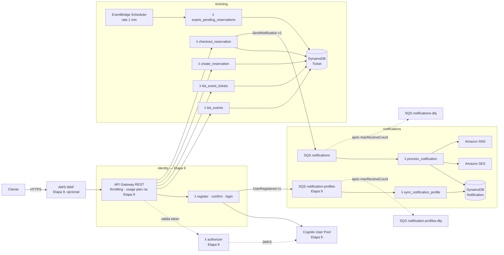

# Arquitetura de execução — AWS serverless

Como o sistema roda na AWS e no ambiente local: componentes, fluxos, resiliência, observabilidade, segurança,
capacidade e MiniStack. A organização do **código** (anéis, Dependency Rule, pastas) está no `AGENTS.md`. Este
documento trata da **implantação**.

---

## 1. Visão geral



Os elementos marcados como **Etapa 9** formam a camada de segurança, construída por último
([DEC-23](requirements.md#dec-23--segurança-por-último)). Até lá, o cliente fala direto com o API Gateway.

Os contextos só se ligam por contratos de mensagem e pelo token, nunca por código:

| De → para | Ligação |
|---|---|
| `ticketing` → `notifications` | Comando `SendNotification`, fila `notifications` ([contracts §3](contracts.md#3-mensagem-sqs-sendnotification)) |
| `identity` → `notifications` | Evento `UserRegistered`, fila `notification-profiles` ([contracts §4](contracts.md#4-mensagem-sqs-userregistered)), Etapa 9 |
| `identity` → `ticketing` | Só o token: o authorizer valida e entrega o `user_id` ao handler, Etapa 9 |

Cada contexto tem as próprias funções, os próprios recursos e as próprias permissões.

---

## 2. Mapa de handlers

Cada função tem um handler, e cada handler é o composition root do seu caso de uso (`AGENTS.md` D12,
[DEC-13](requirements.md#dec-13--uma-função-lambda-por-handler)).

| Função | Gatilho | Caso de uso | Pasta do handler |
|---|---|---|---|
| `list_events` | `GET /events` | UC-01 | `ticketing/infrastructure/entrypoints/http/handlers/` |
| `list_event_tickets` | `GET /events/{event_id}/tickets` | UC-02 | idem |
| `create_reservation` | `POST /events/{event_id}/reservations` | UC-03 | idem |
| `checkout_reservation` | `POST /reservations/{reservation_id}/checkout` | UC-04 | idem |
| `expire_pending_reservations` | EventBridge Scheduler | UC-05 | `ticketing/infrastructure/entrypoints/scheduler/` |
| `process_notification` | SQS `notifications` | UC-06 | `notifications/infrastructure/entrypoints/messaging/` |
| `sync_notification_profile` | SQS `notification-profiles` | UC-11 | idem — **Etapa 9** |
| `register_user`, `confirm_registration`, `authenticate_user` | `POST /auth/register`, `/auth/confirm`, `/auth/login` | UC-08 a UC-10 | `identity/infrastructure/entrypoints/http/handlers/` — **Etapa 9** |
| `authorizer` | Lambda authorizer (TOKEN) do API Gateway | — (só infraestrutura) | `identity/infrastructure/entrypoints/authorizer/` — **Etapa 9** |

---

## 3. Componentes

| Componente | Papel | Configuração relevante | Requisito |
|---|---|---|---|
| **AWS WAF** *(Etapa 9)* | Filtro por IP e de payloads maliciosos | Regras gerenciadas `CommonRuleSet` e `KnownBadInputsRuleSet`, mais regra de limite por IP. Liga/desliga pelo parâmetro `EnableWaf` ([DEC-21](requirements.md#dec-21--waf-no-template-com-ligadesliga)). | — |
| **API Gateway (REST)** | Entrada HTTP | Throttling por stage e por método (Etapa 8). Usage plan com API key por aplicação (Etapa 9). Sem validação de body e sem cache ([DEC-18](requirements.md#dec-18--borda-http-rest-api-em-camadas)). Valores em [§9](#9-capacidade-e-limites). | REQ-10 |
| **Cognito User Pool** *(Etapa 9)* | Usuários, senhas e emissão de tokens | App Client usado pelo servidor, com `ADMIN_USER_PASSWORD_AUTH`. Política de senha e bloqueio de tentativas nativos. Chaves públicas no JWKS ([DEC-19](requirements.md#dec-19--autenticação-com-cognito-no-contexto-identity)). | — |
| **Lambda authorizer** *(Etapa 9)* | Proteção das rotas de escrita | Valida o JWT pelo JWKS do Cognito (assinatura, expiração, emissor, audiência) e repassa o `sub` como `user_id` no contexto. Cache curto de resultado no API Gateway ([DEC-19](requirements.md#dec-19--autenticação-com-cognito-no-contexto-identity)). | — |
| **Lambda** | Execução dos handlers | **Concorrência reservada** em `create_reservation` e `checkout_reservation`. `process_notification` limitada pela concorrência máxima do gatilho SQS, que é o consumo "de forma controlada" ([§9](#9-capacidade-e-limites)). | REQ-11 |
| **DynamoDB** | Persistência | Duas tabelas, on-demand. Escritas condicionais e transacionais ([persistence §4](persistence.md#4-escritas-atômicas)). | REQ-12, REQ-15 |
| **SQS** `notifications` | Buffer entre contextos | Visibility timeout ≥ 6× o timeout da função consumidora (recomendação AWS). Redrive para a DLQ com `maxReceiveCount = 3`. | REQ-13 |
| **SQS** `notifications-dlq` | Mensagens não processáveis | Retenção máxima (14 dias). Alarme quando houver mensagens visíveis. | REQ-16 |
| **SQS** `notification-profiles` + DLQ *(Etapa 9)* | Eventos `UserRegistered` do `identity` para o `notifications` | Fila **separada** da de comandos de envio: ritmo e falhas diferentes, e cada DLQ fala de um só problema ([DEC-27](requirements.md#dec-27--dados-de-usuário-divididos-por-contexto)). `maxReceiveCount = 3`. | REQ-13 |
| **EventBridge Scheduler** | Gatilho da expiração | `rate(1 minute)` → `expire_pending_reservations` | REQ-08 |
| **SES** | E-mail | Identidade de remetente verificada. Em sandbox, só envia para destinos verificados. | REQ-14 |
| **SNS** | SMS | SMS via `Publish` para número. Push via platform endpoint só com a EXT-10. | REQ-14 |

**Adapters de provedor** ([REQ-21](requirements.md#23-conceitos-a-praticar)): `SesEmailAdapter` e `SnsSmsAdapter`
encapsulam o `boto3` em `notifications/infrastructure/clients/`. Eles traduzem a resposta do provedor em
`SendOutcome`: recusa permanente vira `REJECTED(reason)`, e indisponibilidade ou throttling viram exceção de
infraestrutura. As strategies ([domain §3.4](domain.md#34-strategy-de-envio)) dependem deles, e nada do núcleo os
conhece. `SnsPushAdapter` chega com a EXT-10.

---

## 4. Fluxos

### 4.1 Reserva e compra

1. `POST /events/{id}/reservations` → `create_reservation` → UC-03 → transação condicional no `Ticket`.
2. `POST /reservations/{id}/checkout` → `checkout_reservation` → UC-04:
   pagamento simulado → transação condicional → publicação de `SendNotification` na SQS.
3. A SQS aciona `process_notification` → UC-06 → carrega o perfil do usuário → canal preferido e destino → strategy
   do canal → SES ou SNS → registro na tabela `Notification`.

Em nenhum passo o `ticketing` lê dados do usuário além do `user_id`. Quem sabe *por onde* e *para onde* avisar é o
`notifications` ([DEC-27](requirements.md#dec-27--dados-de-usuário-divididos-por-contexto)).

### 4.2 Expiração

1. A cada minuto, o Scheduler aciona `expire_pending_reservations` → UC-05.
2. Consulta do GSI `PendingByExpiration` → uma transação por reserva vencida → estoque devolvido.

### 4.3 Cadastro e perfil de notificação *(Etapa 9)*

1. `POST /auth/register` → `register_user` → UC-08 → `SignUp` no Cognito (e-mail, telefone e canal preferido
   validados).
2. `POST /auth/confirm` → `confirm_registration` → UC-10 → `ConfirmSignUp` no Cognito → publica `UserRegistered` na
   fila `notification-profiles`.
3. A fila aciona `sync_notification_profile` → UC-11 → grava o perfil na tabela `Notification`, sem regredir.

Até a Etapa 9, o passo 3 é substituído pelo seed dos perfis.

---

## 5. Resiliência

| Mecanismo | Onde | Garante |
|---|---|---|
| Escrita condicional e transacional | DynamoDB | Nenhum overbooking, nenhuma transição de estado concorrente dupla |
| Idempotência por `notification_id` | UC-06 | Entrega "ao menos uma vez" da SQS não gera envio duplicado |
| Retry automático | SQS → Lambda | Falhas transitórias (provedor fora) são repetidas |
| DLQ (`maxReceiveCount = 3`, [DEC-17](requirements.md#dec-17--três-tentativas-antes-da-dlq)) | SQS | Mensagem que esgota as tentativas sai do fluxo sem travar a fila |
| Falha parcial de lote (`ReportBatchItemFailures`) | `process_notification` | Só as mensagens que falharam voltam para a fila, não o lote inteiro |
| Validade da reserva no checkout | UC-04 | A expiração vale mesmo se o Scheduler atrasar |

A regra de o que vai para retry e o que é consumido com `FAILED` está em
[DEC-03](requirements.md#dec-03--falha-permanente--falha-transitória-na-notificação).

---

## 6. Observabilidade

### 6.1 Decorator de log ([REQ-22](requirements.md#23-conceitos-a-praticar))

O log de execução dos casos de uso é um **Decorator estrutural**: um objeto que implementa o mesmo protocolo
`UseCase` (`shared/use_case.py`), recebe o use case real no construtor e registra antes e depois de delegar.

- **O que registra:** nome do use case, tipo do request, resultado (`Ok` ou nome do `Err`), duração e `correlation_id`.
- **O que não registra:** conteúdo de campos pessoais (destino, e-mail, telefone).
- **Onde vive:** na infraestrutura. É montado pelo handler em volta do use case. O use case não sabe que está sendo
  decorado.
- **Por que Decorator e não log dentro do use case:** o use case continua livre de detalhe de observabilidade, e o log
  fica uniforme em todos os casos de uso sem repetição.

### 6.2 Logs, métricas e rastreio

- Logs estruturados em JSON, com `aws_lambda_powertools` usado só na infraestrutura, nos handlers. O `AGENTS.md` §5.2
  proíbe o uso dele em `domain/` e `application/`.
- O `correlation_id` segue da requisição HTTP até a mensagem SQS (`reservation_id` no fluxo de compra).
- Métricas mínimas: reservas criadas, conflitos de concorrência, checkouts confirmados, falhas ao publicar
  ([DEC-07](requirements.md#dec-07--falha-ao-publicar-a-notificação-não-desfaz-a-compra)), notificações `SENT` e
  `FAILED` e mensagens na DLQ.

---

## 7. Infraestrutura como código

- Um `template.yaml` (AWS SAM) na raiz declara funções, API, tabelas, filas, Scheduler e permissões
  ([REQ-17](requirements.md#22-arquiteturais-e-de-infraestrutura)).
- O **mesmo template** é implantado no MiniStack (§10) e na AWS. Ele nasce como esqueleto na Etapa 1B e ganha uma função
  por fatia ([DEC-24](requirements.md#dec-24--infraestrutura-local-primeiro-com-ministack)).
- **Configuração** por variável de ambiente, lida **somente no handler** e passada ao núcleo como argumento:

| Variável | Usada por |
|---|---|
| `TICKET_TABLE_NAME` | Funções do `ticketing` |
| `NOTIFICATION_TABLE_NAME` | `process_notification`, `sync_notification_profile` |
| `NOTIFICATION_QUEUE_URL` | `checkout_reservation` |
| `NOTIFICATION_PROFILE_QUEUE_URL` | `confirm_registration` *(Etapa 9)* |
| `RESERVATION_TTL_MINUTES` | `create_reservation` (padrão 10, [DEC-09](requirements.md#dec-09--tempo-de-vida-da-reserva-e-expiração)) |
| `SES_SENDER_ADDRESS` | `process_notification` |
| `AWS_ENDPOINT_URL` | Todas, **só no ambiente local**: aponta os clients `boto3` para o MiniStack (`http://localhost:4566`). Na AWS, fica ausente. |
| `COGNITO_USER_POOL_ID`, `COGNITO_APP_CLIENT_ID` | Funções de `identity` e `authorizer` *(Etapa 9)* |

- **Parâmetros do template** (variam por ambiente):

| Parâmetro | local | dev | prod | Efeito |
|---|---|---|---|---|
| `Stage` | `local` | `dev` | `prod` | Nome do stage e sufixo dos recursos |
| `EnableWaf` *(Etapa 9)* | `false` | `false` | `true` | Cria e associa a Web ACL ([DEC-21](requirements.md#dec-21--waf-no-template-com-ligadesliga)). O MiniStack guarda as regras, mas não bloqueia tráfego. |

- **IAM de menor privilégio por função.** Por exemplo, `list_events` só lê a tabela `Ticket`; `checkout_reservation`
  escreve no `Ticket` e envia para a fila; só `process_notification` chama SES e SNS.

---

## 8. Segurança

A borda é organizada em camadas ([DEC-18](requirements.md#dec-18--borda-http-rest-api-em-camadas)). Cada camada barra
uma ameaça antes que a requisição consuma a seguinte. As camadas 1 a 3 formam a **Etapa 9**, construída depois que
todo o enunciado estiver funcionando ([DEC-23](requirements.md#dec-23--segurança-por-último)).

| Ordem | Camada | Barra | Resposta | Etapa |
|---|---|---|---|---|
| 1 | WAF (se `EnableWaf`) | IP abusivo, força bruta no login, payloads de injeção conhecidos | `403` | 9 |
| 2 | API key + usage plan | Aplicação desconhecida, aplicação acima da cota | `403` / `429` | 9 |
| 3 | Lambda authorizer (rotas de escrita) | Usuário não autenticado, token inválido ou expirado | `401` | 9 |
| 4 | Throttling por método | Sobrecarga total da rota | `429` | 8 |
| 5 | Schema `pydantic` no handler | Formato inválido | `400 InvalidRequest` | 2 em diante |
| 6 | Use case | Violação de regra de negócio; reserva de outro usuário (Etapa 9) | `Err` → §8.2 do `AGENTS.md` | 2 em diante |

| Tema | Tratamento |
|---|---|
| TLS | Política de segurança mínima TLS 1.2 no API Gateway |
| IDOR em reservas | **Risco aceito até a Etapa 9:** `user_id` vem do body. **Não implantar em ambiente exposto antes disso.** Na Etapa 9, `user_id` vem do token, e checkout e cancelamento verificam a propriedade da reserva ([DEC-19](requirements.md#dec-19--autenticação-com-cognito-no-contexto-identity)). |
| Senhas e tokens *(Etapa 9)* | Hash, assinatura e rotação de chaves ficam com o Cognito. A senha passa pelas Lambdas de `/auth/*`: o corpo dessas rotas nunca vai para log, e `/auth/login` tem throttling próprio. O token é validado pelo JWKS (assinatura, expiração, emissor, audiência) e nunca aparece em log. |
| API key | Identifica a aplicação e **não é segredo** em cliente público. Nunca é usada como prova de identidade. |
| Vazamento de erro | `500` com envelope genérico, sem stack trace ([contracts §2.3](contracts.md#23-envelope-de-erro)) |
| Logs do API Gateway | Access log ligado. Execution log com corpo da requisição **desligado**, porque carrega dados pessoais e tokens. |
| Timeouts | Lambdas HTTP com timeout curto (5 a 10 s). O limite de integração do API Gateway é 29 s. |
| Dados pessoais | Destinos de notificação, tokens e o corpo de `UserRegistered` não aparecem em logs (§6.1). E-mail e telefone existem só no Cognito e no perfil de notificação ([DEC-27](requirements.md#dec-27--dados-de-usuário-divididos-por-contexto)). |

---

## 9. Capacidade e limites

Valores e justificativas em [DEC-22](requirements.md#dec-22--capacidade-cada-camada-deixa-passar-menos-que-a-seguinte-aguenta).
Esta seção explica **onde está o gargalo** e o que calibrar no teste de carga da Etapa 8.

### 9.1 Cadeia de capacidade

```text
throttling do API Gateway  ≤  concorrência da Lambda  ≤  vazão do DynamoDB
```

O excesso deve ser recusado **no início da cadeia**, com `429`, e não no fim, com timeout ou erro de banco. A
correção (sem overbooking) não depende desses números: ela vem das escritas condicionais
([persistence §4](persistence.md#4-escritas-atômicas)).

### 9.2 Gargalos conhecidos

| Gargalo | Por quê | Consequência | Mitigação no MVP |
|---|---|---|---|
| **Item quente no DynamoDB** | Todas as reservas de uma categoria escrevem no mesmo item `TICKET_TIER#...`. Cada item aceita ~1.000 WCU/s, e uma transação custa o dobro. | Sob pico, transações se atrapalham e falham com `TransactionConflict` | `ConcurrencyConflict` (409), e o cliente tenta de novo. Limite de escrita mais baixo que o de leitura. |
| **Cota de concorrência da conta** | Contas novas podem ter cota baixa, e a AWS exige manter 100 execuções sem reserva | Concorrência reservada impossível | Conferir no Service Quotas e pedir aumento **antes** da Etapa 8 |
| **SES em sandbox** | ~1 e-mail/s e 200 por dia, só para destinos verificados | Throttling do provedor vira falha transitória e gasta tentativa (DEC-17) | Consumer com `MaximumConcurrency = 2` e lotes pequenos. Pedir saída do sandbox para produção. |
| **Concorrência reservada no consumer da SQS** | Mensagem recusada por falta de capacidade volta para a fila e conta como recebimento | Mensagens saudáveis na DLQ | **Não usar**: limitar pelo `MaximumConcurrency` do gatilho SQS |

### 9.3 Como calibrar (Etapa 8)

1. Medir a duração média de cada handler aquecido e o consumo de WCU por transação.
2. Rodar carga crescente em `POST /events/{event_id}/reservations` sobre **uma única categoria** (pior caso do item quente) e anotar o
   ponto em que `ConcurrencyConflict` cresce.
3. Ajustar o throttling de escrita um pouco abaixo desse ponto e a concorrência reservada para
   `rps × duração` com folga.
4. Registrar os valores medidos em DEC-22 no lugar dos valores iniciais.

O teste de carga roda **na AWS real**: o MiniStack não aplica throttling nem simula o teto de escrita por item (§10.1).

---

## 10. Ambiente local — MiniStack

Decisão e motivo em [DEC-24](requirements.md#dec-24--infraestrutura-local-primeiro-com-ministack). O ciclo de testes de
cada fatia está em [DEC-25](requirements.md#dec-25--ciclo-de-uma-fatia-e-pirâmide-de-testes).

### 10.1 O que cada ambiente valida

| Recurso | MiniStack | AWS real |
|---|---|---|
| DynamoDB: CRUD, escrita condicional, `TransactWriteItems` | ✅ | ✅ |
| SQS, gatilho SQS → Lambda, redrive para a DLQ | ✅ | ✅ |
| EventBridge Scheduler → Lambda | ✅ | ✅ |
| SES e SNS (envio registrado, sem entrega real) | ✅ | ✅ |
| API Gateway REST → Lambda (proxy) | ✅ | ✅ |
| Lambda authorizer TOKEN | ✅ segundo o README; **a confirmar** no teste de viabilidade | ✅ |
| Cognito: cadastro, confirmação, login, JWKS | ✅ segundo o README; **a confirmar** no teste de viabilidade | ✅ |
| CloudFormation / SAM | ✅ (imagem `full`) | ✅ |
| Throttling, usage plan e cota aplicados ao tráfego | ❌ | ✅ (Etapa 8 / 9) |
| WAF bloqueando tráfego | ❌ | ✅ (Etapa 9) |
| Cotas reais (concorrência da conta, SES sandbox, WCU por item) | ❌ | ✅ (Etapa 8) |
| Runtime Python 3.14 | **a confirmar** na Etapa 1B | ✅ |

### 10.2 Peças do ambiente local

| Peça | Papel |
|---|---|
| `docker-compose.yml` | Sobe o MiniStack (imagem `full`, porta 4566, estado persistente opcional) |
| `template.yaml` | O mesmo da AWS, com `Stage=local` |
| `scripts/local-deploy.sh` | Empacota e implanta o template no MiniStack |
| `scripts/seed.py` | Popula eventos, categorias e perfis de notificação de forma idempotente ([persistence §5](persistence.md#5-dados-iniciais)) |
| `tests/e2e/` | Testes que chamam o sistema implantado por HTTP, SQS ou Scheduler |

Alvos do `Makefile`: `local-up`, `local-down`, `local-deploy`, `local-seed` e `test-e2e` (`AGENTS.md` §9).

### 10.3 Código de produção não conhece o MiniStack

O endereço do MiniStack chega **só pela configuração** (`AWS_ENDPOINT_URL`, §7), lida no handler. Nenhum adapter tem
`if local:`. A troca de ambiente é uma troca de variável, o que é a mesma propriedade que permite trocar de framework ou
biblioteca na infraestrutura sem tocar no núcleo.
